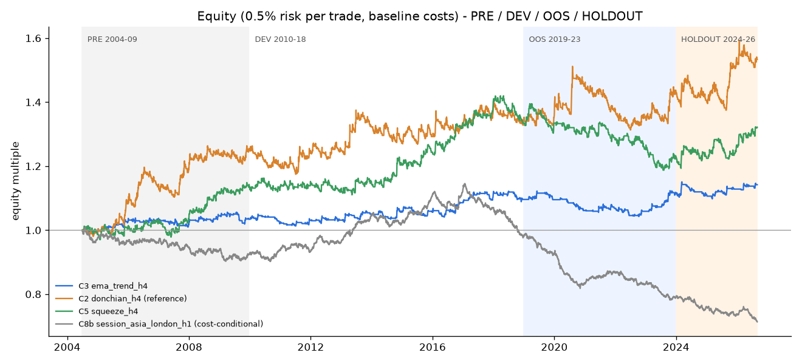
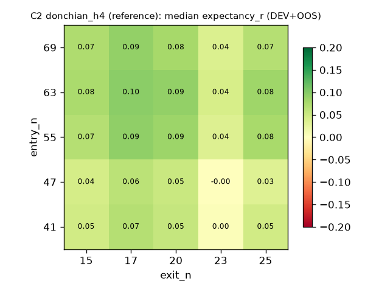

# XAUUSD – automatizovaný swing trading systém: nezávislý výzkum a kvantitativní ověření

*Vypracování zadání „PROJECT: XAUUSD AUTOMATED SWING TRADING SYSTEM“ (Project XAUUSD.docx).
Stav k 2026-10-05. Všechna čísla v tomto reportu jsou reprodukovatelná skripty v `research/`
(viz README); surové výsledky jsou v `research/results/`.*

**Značení tvrzení:** **[E]** empirický důkaz · **[R]** ekonomické zdůvodnění · **[I]** expertní inference ·
**[U]** nepodložený předpoklad. „R“ v tabulkách = násobek rizika obchodu (zisk / riziko ke stop-lossu).

---

## 1. EXECUTIVE CONCLUSION

1. **Žádná z testovaných strategií neprošla všemi předem stanovenými branami robustnosti.**
   Na datech XAUUSD 2010–2023 (DEV + OOS) s realistickými náklady jsem nenašel edge, který bych
   označil za robustní. Holdout 2024–2026 byl kladný, ale připadl na jeden z nejsilnějších býčích
   trhů zlata v historii (~2 050 → ~4 300 USD), kde trendové systémy vydělávají téměř automaticky.
2. **Jediná rodina s konzistentně kladnou (ale slabou) čistou expectancy je střednědobý trend /
   momentum na H4** (holding 3–7 dní). Varianty C3 (EMA 20/100) a C2 (Donchian 55/20) byly kladné ve
   **všech čtyřech nezávislých obdobích** (2004–09, 2010–18, 2019–23, 2024–26), robustní vůči
   perturbaci parametrů (90–96 % sousedních kombinací kladných), timeframu (H2–D1) i 1,5× nákladům.
   Efekt je ale malý: **+0,06 až +0,15 R na obchod, Sharpe 0,25–0,40, t-statistika 1,25–1,71 za
   22 let** – statisticky neodlišitelné od nuly po korekci na počet testů (deflated Sharpe 0,39–0,53).
3. **Mean reversion (C6 RSI(2), C7 z-score), volatility breakout (C4), denní TSMOM (C1) a
   session/čas-v-dni (C8, C8b) jsem zamítl.** C6 a C8 byly předregistrované favority z literatury –
   na XAUUSD selhaly už před náklady. Asijsko-londýnský intradenní vzor (C8b) je skutečná hrubá
   anomálie (hrubý Sharpe 1,27 v 2010–2023), ale náklady ji zcela pohltí a od 2016 slábne.
4. **Tři „nejsilnější kandidáti“ (C3, C2, C5) jsou fakticky jedna sázka** (trend/momentum):
   při současné pozici jsou ve stejném směru v 99–100 % času, denní korelace 0,34–0,45, korelace
   drawdownů 0,67–0,70, všechny ztrácejí ve stejných režimech (VIX > 25, vysoká volatilita).
   **Důkazy nepodporují tři skutečně odlišné silné přístupy – podporují nanejvýš jeden, a ten slabý.**
5. **Doporučení:** nic nenasazovat s reálným kapitálem. Postoupit pouze do fáze **PAPER**
   (pozorovací, bez kapitálu) s jedním společným rizikovým rozpočtem pro celou trendovou rodinu,
   s cílem změřit skutečné náklady brokera a implementační věrnost. Postup dál jen přes objektivní
   brány v kapitole 22. Realistické očekávání i v případě úspěchu: jednociferný roční výnos při
   nízkém riziku a víceleté období pod vodou (portfolio 2018-01 → 2023-12 bez nového maxima).
6. **Dodaná architektura** (Python balíček `tradingsystem/`) je hotová a otestovaná: data →
   signály → strategie → risk → exekuce → portfolio → broker adapter (SimBroker, MetaTrader 5) →
   ledger → monitoring. Stejný kód strategie běží v backtestu, paper, demo i live; test parity
   ukazuje identické obchody v backtestu a live driveru (165/165).

**„Nejlepší historický výsledek“ vs. „nejlepší kandidát pro budoucí live robustnost“:**
nejlepší historický výsledek (2004–2026 i holdout) má **C2 Donchian H4** (pooled t = 1,71, holdout
Sharpe 0,51). Nejlepším kandidátem pro budoucí robustnost (pořadí zmrazené před holdoutem) je
**C3 EMA trend H4** – nejvyrovnanější profil, nejnižší PBO z trojice C2/C3/C9, kladná expectancy i
při 2× nákladech. Rozdíl mezi nimi je v rámci šumu.



---

## 2. RESEARCH METHODOLOGY

**Postup (s doložitelnou chronologií v gitu):**

| Krok | Commit | Obsah |
|---|---|---|
| 1. Rešerše literatury | — | kapitola 3 |
| 2. Datová pipeline + engine | `6a151db` | `research/prepare_data.py`, `tradingsystem/` |
| 3. **Předregistrace** | `6a151db` | `research/PROTOCOL.md` (splity, apriorní parametry, perturbační mřížky, nákladový model, 8 bran přijetí) + scorecard |
| 4. DEV screen 10 kandidátů | `41ce7b8` | `results/s01_dev_screen.md`, rozhodnutí `research/DEV_SELECTION.md` **před** OOS |
| 5. Plná validace (OOS, WF, perturbace, TF, zpoždění, náklady, režimy, bootstrap) | `cfe78c3` | `results/s02_*.md`, `results/s03_portfolio.md` |
| 6. **Zmrazení specifikace a pořadí** | `cfe78c3` | `research/frozen_spec.json` **před** holdoutem |
| 7. Holdout 2024–2026 (jednou) | tento commit | `results/s04_holdout.md` |
| 8. Souhrn 2004–2026 + grafy | tento commit | `results/s05_pooled.md`, `results/figures/` |

**Data** (detail `results/data_quality.json`):

| Sada | Zdroj | Období | Cena | Časová zóna | Kvalita |
|---|---|---|---|---|---|
| A | Dukascopy-format M1 bid/ask (GitHub mirror Dypoi/XAUUSD_Dataset) | 2016-09-01 – 2026-09-01 | bid + ask OHLC | UTC (ověřeno: nedělní open 22/23 UTC, páteční close 21/22 UTC) | 3,55 mil. M1 barů, 0 záporných spreadů, 8 127 duplicit na hranicích souborů (odstraněny), díry > 2 h jen o svátcích; medián spreadu 0,24–0,69 USD (1,5–2,3 bp) |
| B | MT4 broker H1 (GitHub FeziweMelvin/XAUUSD-Gold-Price, skript nvn01) | 2004-06-11 – 2025-06-06 | bid OHLC | server GMT+2/+3 (= NY+7), ověřeno korelací s A | korelace H1 výnosů s A 0,94, medián cenového rozdílu 0,04 USD; ask syntetizován z mediánového spreadu A podle hodiny (kalibrace jen 2016-09 – 2018-12) |
| Makro | VIX (CBOE via datasets/finance-vix), USD index s vahami DXY z Fed H.10 (datasets/exchange-rates), US Treasury 3M/2Y/10Y (fujiapple852/yield) | 1990/2000 – 2026 | denní | US datum | vždy zpožděno o 1 obchodní den |

* **Serverový čas = New York + 7 h** (konvence MT5 brokerů GMT+2/+3) → 5 denních svíček týdně,
  denní svíčka = 17:00–17:00 NY. Všechny timeframy jsou agregovány z M1 (A) resp. H1 (B).
* **Nemíchám zdroje potichu:** výzkumná řada je B do 2016-08-31 a A od 2016-09-01 (sloupec `source`),
  OOS a holdout jsou čistě na A s reálným bid/ask. Křížová kontrola A vs. B na 2016-09 – 2018-12
  dává kvalitativně stejné závěry (tabulka v `s01_dev_screen.md`).
* Tick data nejsou k dispozici → jde o **bar-level výzkum s exekucí na bid/ask** (ne tick-level validaci).

**Rozdělení (striktně chronologické):** PRE-SAMPLE 2004-07 – 2009-12 (B, nepoužit k vývoji) ·
**DEV 2010-01 – 2018-12** (~54 %) · **OOS 2019-01 – 2023-12** (~30 %) · **HOLDOUT 2024-01 – 2026-08** (~16 %).

**Simulace (`tradingsystem/brokers/simulated.py`):** signál na close baru, market fill na open
dalšího baru (ask pro long, bid pro short) + skluz; stop-entry plní na horší z (úroveň, open);
stop-loss na bid/ask, gap na open; SL i TP v jednom baru → předpoklad SL; pozice otevřená v baru
může být v témže baru vystopována; swap při každém rollover 17:00 NY, trojitý ve středu;
„spread guard“ odkládá market příkazy, když spread na open > 4 bp (např. po denním znovuotevření).
Stopy se řeší na H1 granularitě i pro H4/D1 strategie.

**Nákladový model (baseline):** reálný bid/ask (A; ~1,9 bp mediánově) · skluz 0,3 bp (market) /
1,0 bp (stop) · komise 0 (spread-only účet) · swap long = −(3M T-bill + 2,25 %) p.a., short =
+(3M T-bill − 2,25 %) p.a., ACT/360 (kalibrováno na typický retail swap 2024–25: long −60 / short
+19 bodů). Stres ×1,5 a ×2 škáluje spread, skluz, komisi i swapovou přirážku.

**Sizing ve výzkumu:** 0,5 % equity na obchod k ATR stop-lossu (equity rebasovaná na začátku
měsíce), 100 000 USD start. Výsledky v R jsou na sizing invariantní.

**Testy kódu:** 14 unit testů (fill logika, gapy, swapy, spread guard, kauzalita indikátorů,
sizing, limity, idempotence příkazů vč. restartu, časová pásma, **parita backtest vs. live driver**).

**Odchylky od předregistrace (úplný výčet):**
1. Před commitem protokolu proběhl jeden smoke-test C2 na DEV podmnožině 2016-09 – 2018-12 (kontrola enginu, žádná OOS data).
2. Po prvním DEV screenu jsem opravil dvě chyby enginu (nešlo „exit-and-reverse“ → krátká noha C8 se nikdy neotevřela; bezfrikční běh odmítal nulový spread) a DEV screen zopakoval.
3. **C8b je data-driven revize C8 odvozená z DEV hodinového profilu** (riziko data-miningu; viz 17).
4. Předvybrané C2/C6/C8 selhaly na DEV bráně 1 → nahrazeny kontrolními C3, C5, C9 podle pravidla deklarovaného v `DEV_SELECTION.md` (před OOS); doplňkové mřížky deklarovány tamtéž.
5. Rizikové váhy portfolia (1/3 na strategii) určeny po DEV+OOS portfolio analýze, před holdoutem.

---

## 3. INTERNET EVIDENCE REVIEW

Pozn.: síťová politika sandboxu blokovala plné texty (arXiv, SSRN, FRED), vycházím z abstraktů,
souhrnů a citací dohledaných vyhledávačem; detaily, které jsem nemohl ověřit, jsou označeny.

### 3.1 Trend / time-series momentum (TSMOM)
* **[E]** Moskowitz, Ooi, Pedersen (2012, *JFE* 104:228–250): TSMOM ve 58 futures (komodity vč. zlata, měny, akcie, dluhopisy), 12m lookback, efekt trvá ~1 rok a pak se částečně obrací.
* **[E]** Hurst, Ooi, Pedersen (2017, *JPM*): TSMOM ziskový v 67 trzích 1880–2016, „crisis alpha“.
* **[E]** Szakmary, Shen, Sharma (2010, *JBF* 34:409–426): trendová pravidla (MA, kanály) ziskové ve většině komoditních futures.
* **[E]** Han, Hu, Yang (2016, *JBF* 70:214–234): MA timing v komoditách porazil buy&hold, robustní k nákladům a délce MA, nízký obrat.
* **[E/R]** Levine & Pedersen (2016, *FAJ* 72(3)): TSMOM a MA crossover jsou ekvivalentní lineární filtry → C2/C3/C5 jsou stejná sázka.
* **[E]** Baltas & Kosowski (2013; 2020 kapitola *Market Momentum*): volba odhadu volatility a trendového pravidla mění obrat o > 1/3 bez změny výkonu.
* **[E]** Goulding, Harvey, Mazzoleni (2024, *FAJ* 80(1) „Breaking Bad Trends“): body obratu (rozpor pomalého a rychlého signálu) výrazně snižují výnos trendu.
* **[E – preprint]** Kurth, Eisler, Rej, Bouchaud (2026-07, arXiv 2607.01550): po ~2009 se P&L **krátkodobého** trendu zhroutil na „small-tick“ kontraktech (tick malý vůči volatilitě), na „large-tick“ přetrvává. Zlato je small-tick → **negativní apriorní důkaz pro rychlý trend na XAUUSD** [I]. Náš výsledek (slabý H4 trend) je s tím konzistentní.
* **[E]** Park & Irwin (2007, *J. Econ. Surveys* 21:786–826): technická analýza ziskové ve futures cca do začátku 90. let; většina studií trpí data-snoopingem.
* **[E]** Marshall, Cahan, Cahan (2008, *JBF* 32:1810–1819): po kontrole data-snoopingu nejsou kvantitativní timing pravidla v komoditních futures ziskové.
* **[E]** Batten, Lucey, McGroarty, Peat, Urquhart (2018, *JIFMIM* 52:102–113): intradenní MA pravidla v drahých kovech se standardními parametry bez prediktivní síly; některé kombinace u zlata ano → typický vzorec data-miningu.
* **[R]** Proč by trend mohl existovat: pomalá difúze informací a nedoreakce, hedging pressure, pomalý kapitál, stádní chování a zpětná vazba samotných CTA (Kurth et al.). **[I]** U zlata navíc dlouhé makro cykly (reálné sazby, poptávka centrálních bank).
* **[I]** Kontext: komodity tvořily cca polovinu výnosů trendových CTA do 12/2024 (Top Traders Unplugged / Quantica).

### 3.2 Zlato specificky (makro, režimy)
* **[E]** Baur & McDermott (2010, *JBF* 34:1886–1898): zlato je hedge a safe haven pro vyspělé akciové trhy (1979–2009), zvlášť v akutní krizi.
* **[E]** Baur (2012, *J. Alternative Investments*): **inverzní asymetrie volatility** – pozitivní šoky zvyšují volatilitu víc než negativní. **[I]** Long breakouty proto čelí větším whipsawům – konzistentní s tím, že long strana C3 byla v DEV/OOS bez edge.
* **[E]** Erb & Harvey (2013, *FAJ* 69(4) „The Golden Dilemma“): reálná cena zlata negativně souvisí s reálnými sazbami; zlato je na praktických horizontech nespolehlivý inflační hedge; (2024 SSRN „Is There Still a Golden Dilemma?“).
* **[E/I]** Vztah zlato–reálné výnosy se po 2022 rozpadl (korelace ~0,84 v 2005–2021 → ~0,03 v 2022–23; J.P. Morgan PB, Janus Henderson); centrální banky nakoupily > 1 000 t ročně v 2022–2024 (World Gold Council). → makro filtry kalibrované na historii jsou nestabilní (C9).
* **[E]** Elder, Miao, Ramchander (2012, *JBF* 36:51–65): US makro zprávy (8:30 ET, NFP) hýbou zlatem rychle; dobré zprávy → zlato dolů.

### 3.3 Sezónnost a čas v dni
* **[E]** Blose, Gondhalekar, Kort (2018, *J. Economics & Finance* 42:526–549): **overnight výnosy zlata kladné, denní (COMEX day session) záporné**, 1985–2012, v COMEX futures, London fix, ETF i těžařích, ekonomicky významné i po nákladech.
* **[E]** „Night effect“ v čínských futures na zlato a stříbro (2025, *Global Finance Journal* 64).
* **[E]** Caminschi & Heaney (2014, *J. Futures Markets* 34(11)): únik informací z London PM fixingu.
* **[I/U]** Praktici: „London bias“ – zlato roste v asijských hodinách a klesá během Londýna/NY (goldpriceforecast.com; FXStreet 2026: „gold up in Asian markets, down big in the West“).
* **[E]** Baur (2013, *RIBAF* 27:1–11): „autumn effect“ – září a listopad jediné významně kladné měsíce 1980–2010.
* **[E]** Blose & Gondhalekar (2013, *Accounting & Finance* 53:609–622): nižší víkendové výnosy, hlavně v medvědích trzích.

### 3.4 Mean reversion, volatility breakout, sizing
* **[E]** Caporale & Plastun (2019/2021, CESifo WP 8445; *FMPM*): zlato 2009–2019 – kontrariánský efekt den po abnormálním pohybu, ale i „inertia“ (pokračování).
* **[E]** Holmberg, Lönnbark, Lundström (2013, *Finance Research Letters* 10:27–33): ORB ziskový v crude oil 2001–2011; pro zlato jen diplomové práce (Sönnert) → slabý důkaz.
* **[E]** Li, Sakkas, Urquhart (2022, *J. Financial Markets*): intradenní TSMOM v 16 akciových trzích (ne zlato).
* **[E]** Harvey et al. (2018, *JPM* 45(1) „The Impact of Volatility Targeting“): vol-targeting nezvyšuje Sharpe u komodit, ale snižuje levé chvosty → ATR-sizing používám kvůli riziku, ne kvůli výnosu.

### 3.5 Metodika proti overfittingu
* **[E]** Bailey, Borwein, López de Prado, Zhu (2017, *J. Computational Finance* 20(4)): PBO a CSCV.
* **[E]** Bailey & López de Prado (2014, *JPM*): Deflated Sharpe Ratio.
* **[E]** Harvey, Liu, Zhu (2016, *RFS*): při mnoha testech je třeba t > 3.
* **[U]** Singha et al. (2025, arXiv 2511.08571) tvrdí Sharpe 2,88 a max DD 0,52 % na zlatých futures 2015–2025 z jednoduchých trend/momentum signálů – **nevěrohodné** (neodpovídá žádné jiné evidenci), nepoužito.

### 3.6 Broker realita
* **[E]** Specifikace XAUUSD (RoboForex): 1 lot = 100 oz, min. 0,01 lotu, krok 0,01, swap long −60 / short +19 bodů, trojitý swap ve středu; ECN účty s komisí. MQL5 dokumentace Python integrace: `symbol_info` (`trade_contract_size`, `volume_min/step`, `filling_mode`), `order_send`, režimy plnění FOK/IOC.

---

## 4. CANDIDATE STRATEGY UNIVERSE

| ID | Rodina | Apriorní pravidla (literatura) | TF / držení |
|---|---|---|---|
| C1 | Time-series momentum | znaménko 60denního výnosu, stop 3×ATR | D1 / týdny–měsíce |
| C2 | Price-channel (Donchian/Turtle) breakout | vstup 55-bar kanál, výstup 20-bar kanál, stop 2×ATR20 | H4 / 3–10 dní |
| C3 | MA trend | EMA 20/100 cross, trailing 3×ATR | H4 / 2–8 dní |
| C4 | Volatility / range-expansion breakout | OCO stop-entry close ± 0,5×ATR14, stop 1 ATR, exit po 2 dnech | D1 / 1–3 dny |
| C5 | Momentum po konsolidaci (squeeze) | Bollinger bandwidth v dolních 20 % (120 barů) → close mimo pásmo, stop 2×ATR, exit přes střed / 30 barů | H4 / 1–5 dní |
| C6 | Podmíněná mean reversion (Connors) | SMA200 trend + RSI(2) < 10 / > 90, exit přes SMA5, max 10 dní, stop 3×ATR | D1 / 2–7 dní |
| C7 | Volatilitou podmíněná mean reversion | z-score(48) < −2 / > 2 při efficiency ratio < 0,3, exit na průměru / 24 h | H1 / 4–24 h |
| C8 | Čas v dni (overnight drift) | long 19:00→08:00 NY, short 08:00→14:00 NY | H1 / 6–13 h |
| C9 | Makro-podmíněný trend | C2 + filtr USD indexu (50denní MA) | H4 / 3–10 dní |
| C10 | Kalendářní sezónnost | long září + listopad | měsíc |
| C11 | ML klasifikátor směru | — | — |

**Vyloučeno předem** (dle zadání): SMC/ICT, ručně kreslené S/R, order blocks, Elliott, nedefinované
patterny, martingale, grid, průměrování ztrát, neprůhledné NN. Carry/swap jako zdroj edge – u zlata
je carry pro long záporné, edge neexistuje [R].

---

## 5. CANDIDATE SCORECARD

Skóre 0–100 (vyšší = lepší; u nákladů a overfittingu vyšší = *méně* citlivé). Váhy: důkazy 15 %,
ekonomické zdůvodnění 12 %, robustnost napříč režimy 12 %, odolnost vůči overfittingu 12 %,
citlivost na náklady 10 %, srozumitelnost implementace 6 %, velikost vzorku 8 %, nároky na data 5 %,
přenositelnost mezi brokery 5 %, vhodnost pro XAUUSD 10 %, kompatibilita s risk managementem 5 %.
Tvrdá podmínka: horizont držení 4 h – 10 dní. (Zdroj: `research/scorecard.py`, sepsáno před backtestem.)

| Kandidát | Vážené skóre | Horizont OK | Důkazy | Zdůvodnění | Režimy | Overfit | Náklady | Jasnost | Vzorek | Data | Přenos. | XAUUSD | Risk |
|---|---|---|---|---|---|---|---|---|---|---|---|---|---|
| C1 TSMOM D1 | 73,7 | **ne** | 85 | 75 | 55 | 80 | 85 | 90 | 35 | 95 | 95 | 60 | 70 |
| C2 Donchian H4 | 71,7 | ano | 65 | 70 | 50 | 75 | 70 | 95 | 70 | 95 | 95 | 65 | 85 |
| C8 Session drift H1 | 71,5 | ano | 65 | 60 | 55 | 85 | 40 | 95 | 95 | 95 | 70 | 80 | 85 |
| C3 EMA trend H4 | 68,5 | ano | 60 | 70 | 50 | 70 | 70 | 95 | 60 | 95 | 95 | 60 | 75 |
| C6 RSI(2) pullback D1 | 62,7 | ano | 50 | 60 | 55 | 60 | 55 | 90 | 60 | 95 | 95 | 55 | 70 |
| C9 USD-filtrovaný Donchian | 59,0 | ano | 50 | 70 | 40 | 55 | 70 | 75 | 50 | 50 | 70 | 60 | 85 |
| C4 Volatility breakout D1 | 58,8 | ano | 45 | 50 | 40 | 55 | 45 | 85 | 85 | 95 | 90 | 50 | 80 |
| C10 Podzimní sezónnost | 55,7 | **ne** | 40 | 35 | 40 | 60 | 85 | 95 | 10 | 95 | 95 | 60 | 60 |
| C5 Squeeze H4 | 54,3 | ano | 30 | 45 | 45 | 45 | 60 | 85 | 50 | 95 | 95 | 50 | 80 |
| C7 Z-score MR H1 | 53,9 | ano | 35 | 50 | 35 | 45 | 35 | 85 | 90 | 95 | 95 | 45 | 65 |
| C11 ML | 34,7 | ano | 20 | 20 | 20 | 10 | 40 | 30 | 80 | 60 | 80 | 40 | 50 |

Zdůvodnění klíčových skóre: C1 má nejsilnější akademickou evidenci, ale drží týdny–měsíce (mimo
mandát) → jen benchmark. C2 – klasická evidence, ale negativní signál z Kurth et al. pro rychlý trend.
C8 – recenzovaná gold-specifická evidence (Blose et al. 2018), nula parametrů, ale ~250 obchodů/rok
→ extrémní citlivost na náklady. C6 – kontrariánský efekt u zlata (Caporale & Plastun), negativní
šikmost. C10 – 2 obchody ročně = statisticky netestovatelné. C11 – mandát vyžaduje robustní baseline.

**Předregistrovaný výběr pro backend testování:** C2 (trend), C8 (session), C6 (mean reversion) –
nejvyšší skóre s horizontem „ano“ a preferencí komplementarity (C3 = stejná sázka jako C2).

---

## 6. THREE SELECTED STRATEGIES

**Co se stalo s předregistrovaným výběrem (DEV 2010–2018, baseline náklady, `s01_dev_screen.md`):**

| Kandidát | Obch. | Exp. R | t | PF | Sharpe | Hrubá exp. R | Brána 1 (exp>0, PF>1,10) |
|---|---|---|---|---|---|---|---|
| C1 TSMOM D1 | 106 | −0,002 | −0,02 | 0,98 | 0,03 | 0,055 | ne |
| **C2 Donchian H4** * | 241 | 0,064 | 0,56 | 1,09 | 0,19 | 0,183 | **ne (těsně)** |
| C3 EMA trend H4 | 163 | 0,074 | 0,86 | 1,22 | 0,31 | 0,116 | ano |
| C4 Volatility breakout D1 | 697 | −0,036 | −1,21 | 0,89 | −0,39 | 0,010 | ne |
| C5 Squeeze H4 | 331 | 0,109 | 1,40 | 1,24 | 0,48 | 0,165 | ano |
| **C6 RSI(2) pullback D1** * | 260 | −0,018 | −0,68 | 0,88 | −0,27 | **−0,004** | **ne** |
| C7 Z-score MR H1 | 1 494 | −0,117 | −4,35 | 0,75 | −1,41 | −0,067 | ne |
| **C8 Session drift H1** * | 4 520 | −0,018 | −2,90 | 0,89 | −0,99 | **0,001** | **ne** |
| C9 USD-filtrovaný Donchian H4 | 144 | 0,192 | 1,15 | 1,31 | 0,37 | 0,353 | ano |
| C8b Asie long / Londýn short (DEV-derived) | 4 569 | 0,003 | 0,62 | 1,02 | 0,21 | 0,022 | ne |

\* předregistrovaná volba. C6 i C8 jsou záporné/nulové **už před náklady** → zamítnuty.

Podle pravidla náhrady (deklarováno před OOS) šli do plné validace kandidáti, kteří prošli DEV
bránou 1, seřazení podle t-statistiky: **C5, C9, C3**; navíc transparentně C2 (předregistrovaná
reference) a C8b (jediná ne-momentum anomálie se silným hrubým efektem). **Všichni tři náhradníci
jsou stejná ekonomická sázka (trend/momentum) – to jsem explicitně zapsal už před OOS.**

**Finální trojice po validaci (zmrazeno před holdoutem, `frozen_spec.json`):**
1. **C3 EMA trend H4**, 2. **C2 Donchian breakout H4**, 3. **C5 Squeeze breakout H4** – jedna rodina.
C9 vypadla (korelace 0,79 s C2, potřebuje živý USD index, OOS ≈ 0); C8b zamítnuta.

---

## 7. EXACT STRATEGY DEFINITIONS

Společné pro všechny tři: symbol XAUUSD; signál se počítá na **uzavřeném** H4 baru z mid cen
(bid+ask)/2; H4 bary ukotvené na serverovou půlnoc (NY+7: 00, 04, …, 20); market příkaz se plní
na open dalšího baru (live: jakmile je trh otevřený a spread ≤ 4 bp, max. odklad 3 h); stop-loss je
broker-side; **jedna pozice na strategii, žádné pyramidování, žádné průměrování**; re-entry jen na
nový signál; position sizing = riziko × equity na začátku měsíce / (|vstup − stop| × 100 oz),
zaokrouhleno **dolů** na 0,01 lotu; risk 0,5 % × váha strategie (portfolio: 1/3 každá).
Žádný take-profit (trendové výstupy). Žádná omezení session kromě spread guardu a denní přestávky.
Simultánní pozice různých strategií jsou povoleny v limitech risk manageru (kapitola 20.4).

### C3 – EMA trend H4 (`tradingsystem/strategies/trend.py::EmaTrend`)
* Výpočty: EMA(20) a EMA(100) z close; ATR(20) (prostý průměr true range); `hc` / `lc` = nejvyšší /
  nejnižší close za 20 barů.
* **Long vstup:** EMA20 překříží EMA100 nahoru (stav +1, předchozí ≤ 0). **Short vstup:** zrcadlově.
* **Počáteční stop:** close ∓ 3,0 × ATR20.
* **Trailing stop:** long max(stávající stop, hc − 3×ATR20); short min(stávající, lc + 3×ATR20) – jen zpřísňuje.
* **Výstup:** opačný cross EMA (signál na close) nebo zásah stopu. Max. držení: neomezeno (typicky 2–8 dní; průměr 128 h).
* Parametry: 4 (fast, slow, atr_n, stop_atr), všechny literaturní default.

### C2 – Donchian breakout H4 (`DonchianBreakout`)
* Výpočty: HH55 / LL55 = nejvyšší high / nejnižší low **předchozích** 55 H4 barů (~9,5 dne);
  XH20 / XL20 = totéž pro 20 barů (~3,5 dne); ATR(20).
* **Long vstup:** close > HH55. **Short vstup:** close < LL55.
* **Počáteční stop:** close ∓ 2,0 × ATR20 (Turtle „2N“).
* **Trailing / výstup:** stop se posouvá na XL20 (long) / XH20 (short), pokud je těsnější; výstup
  také na close pod XL20 / nad XH20. **Time-stop:** 90 H4 barů (15 dní).
* Parametry: 5 (entry_n 55, exit_n 20, atr_n 20, stop_atr 2,0, max_hold 90).

### C5 – Squeeze breakout H4 (`tradingsystem/strategies/breakout.py::SqueezeBreakout`)
* Výpočty: Bollinger(20, 2σ), bandwidth = 4σ/SMA20; percentilové pořadí bandwidth v posledních
  120 barech; „squeeze“ = pořadí < 0,20 kdykoli v posledních 5 barech; ATR(20).
* **Long vstup:** squeeze a close > horní pásmo. **Short:** squeeze a close < dolní pásmo.
* **Stop:** close ∓ 2,0 × ATR20. **Výstup:** close přes střední pásmo (SMA20) nebo po 30 barech (5 dní).
* Parametry: 8 (bb_n, bb_k, rank_n, squeeze_pct, lookback, atr_n, stop_atr, max_hold) – nejvíc stupňů volnosti z trojice.

### Zamítnuté, ale plně definované (pro úplnost)
* **C8b** (`session.py::AsiaLondonSession`): long open server 02 (19:00 NY) → exit server 09 (02:00 NY); short 09 → 15 (08:00 NY); katastrofický stop 1× průměrné denní rozpětí; exit-and-reverse v 09:00.
* **C6** (`meanrev.py::TrendPullbackRSI`), **C9** (`trend.py::MacroFilteredDonchian`), **C4**, **C7**, **C1** – viz kód.

---

## 8. QUANTITATIVE BACKTEST RESULTS

Kompletní metriky (baseline náklady, 100 000 USD, 0,5 % riziko/obchod; portfolio 1/3 váhy a
produkční limity zapnuté). PnL v USD.

| Strategie | Segment | Obch. | /rok | Win % | Ø zisk R | Ø ztráta R | Exp. R | t | PF | Sharpe | Sortino | CAGR % | MaxDD % | Calmar | Expozice % | Ø držení h | Max ztr. série | Long PnL | Short PnL | Gross PnL | Net PnL |
|---|---|---|---|---|---|---|---|---|---|---|---|---|---|---|---|---|---|---|---|---|---|
| C3 EMA trend H4 | DEV | 163 | 18,1 | 35,0 | 1,16 | −0,51 | 0,074 | 0,85 | 1,22 | 0,31 | 0,51 | 0,65 | 3,7 | 0,18 | 28 | 133 | 12 | −70 | 6 051 | 9 739 | 5 981 |
| C3 EMA trend H4 | OOS | 93 | 18,6 | 34,4 | 1,07 | −0,51 | 0,038 | 0,38 | 1,12 | 0,16 | 0,27 | 0,36 | 7,4 | 0,05 | 26 | 120 | 11 | −460 | 2 258 | 3 762 | 1 797 |
| C3 EMA trend H4 | DEV+OOS | 256 | 18,3 | 34,8 | 1,13 | −0,51 | 0,061 | 0,93 | 1,18 | 0,25 | 0,41 | 0,53 | 7,4 | 0,07 | 27 | 128 | 12 | −581 | 8 324 | 13 586 | 7 743 |
| C3 EMA trend H4 | HOLDOUT | 49 | 18,4 | 34,7 | 1,39 | −0,58 | 0,106 | 0,54 | 1,27 | 0,37 | 0,59 | 0,88 | 4,7 | 0,19 | 22 | 101 | 6 | 4 174 | −1 807 | 3 359 | 2 368 |
| C2 Donchian H4 | DEV | 241 | 26,8 | 32,4 | 1,99 | −0,86 | 0,064 | 0,56 | 1,09 | 0,19 | 0,31 | 0,83 | 8,5 | 0,10 | 46 | 152 | 8 | −251 | 6 983 | 15 840 | 6 731 |
| C2 Donchian H4 | OOS | 132 | 26,4 | 28,8 | 2,45 | −0,86 | 0,094 | 0,46 | 1,14 | 0,26 | 0,41 | 1,19 | 13,5 | 0,09 | 44 | 142 | 8 | 12 770 | −7 073 | 11 337 | 5 697 |
| C2 Donchian H4 | DEV+OOS | 373 | 26,7 | 31,4 | 2,13 | −0,86 | 0,081 | 0,79 | 1,13 | 0,22 | 0,35 | 1,00 | 13,4 | 0,07 | 45 | 149 | 8 | 15 072 | −635 | 29 740 | 14 437 |
| C2 Donchian H4 | HOLDOUT | 76 | 28,5 | 30,3 | 2,75 | −0,91 | 0,197 | 0,74 | 1,31 | 0,51 | 0,74 | 2,66 | 8,0 | 0,33 | 46 | 142 | 10 | 17 534 | −10 279 | 10 882 | 7 255 |
| C5 Squeeze H4 | DEV | 331 | 36,8 | 38,4 | 1,44 | −0,72 | 0,109 | 1,40 | 1,24 | 0,48 | 0,81 | 1,92 | 6,4 | 0,30 | 34 | 82 | 7 | 9 967 | 8 724 | 28 188 | 18 691 |
| C5 Squeeze H4 | OOS | 179 | 35,9 | 29,6 | 1,50 | −0,76 | −0,092 | −0,94 | 0,82 | −0,41 | −0,61 | −1,66 | 15,2 | −0,11 | 29 | 72 | 10 | −8 368 | 359 | −3 267 | −8 009 |
| C5 Squeeze H4 | DEV+OOS | 510 | 36,5 | 35,3 | 1,46 | −0,74 | 0,038 | 0,63 | 1,07 | 0,17 | 0,27 | 0,62 | 16,9 | 0,04 | 32 | 78 | 10 | 81 | 8 994 | 24 213 | 9 075 |
| C5 Squeeze H4 | HOLDOUT | 95 | 35,7 | 31,6 | 2,15 | −0,76 | 0,162 | 0,88 | 1,31 | 0,65 | 1,03 | 2,82 | 5,2 | 0,54 | 32 | 77 | 13 | 14 811 | −7 317 | 9 975 | 7 494 |
| Portfolio C3+C2+C5 (1/3) | DEV+OOS | 1 107 | 79,2 | 33,7 | 1,60 | −0,74 | 0,052 | 1,11 | 1,10 | 0,24 | 0,39 | 0,65 | 7,5 | 0,09 | 64 | 113 | 20 | 4 260 | 5 155 | 20 736 | 9 415 |
| Portfolio C3+C2+C5 (1/3) | HOLDOUT | 218 | 81,8 | 32,1 | 2,16 | −0,77 | 0,171 | 1,32 | 1,35 | 0,72 | 1,13 | 2,18 | 4,0 | 0,55 | 65 | 105 | 17 | 11 753 | −5 900 | 8 043 | 5 853 |

**Pre-sample 2004–2009 (B, nepoužit k vývoji):** C3 exp 0,064 R (PF 1,18), C2 0,316 R (PF 1,54),
C5 0,122 R (PF 1,26), C9 0,123 R, C8b −0,005 R.

**Souhrn 2004-07 – 2026-08 (všechny 4 segmenty, `s05_pooled.md`):**

| Strategie | Obch. | Exp. R | t | PF | Sharpe | Kladné segmenty (ze 4) | Long exp. R | Short exp. R |
|---|---|---|---|---|---|---|---|---|
| C3 EMA trend H4 | 412 | 0,067 | 1,25 | 1,20 | 0,27 | 4 | 0,101 | 0,035 |
| C2 Donchian H4 | 595 | 0,149 | 1,71 | 1,25 | 0,40 | 4 | 0,384 | −0,147 |
| C5 Squeeze H4 | 810 | 0,074 | 1,46 | 1,16 | 0,33 | 3 | 0,136 | 0,009 |
| C9 USD-filtr Donchian | 371 | 0,125 | 1,12 | 1,19 | 0,26 | 3 | 0,335 | −0,120 |
| C8b Session | 11 281 | −0,006 | −2,15 | 0,95 | −0,46 | 1 | −0,001 | −0,010 |

Gross vs. net: náklady berou 40–65 % hrubého zisku trendových strategií (např. C2 DEV+OOS
hrubě 29,7 tis. → čistě 14,4 tis.); významnou položkou je **swap** u vícedenních longů
(C5 DEV+OOS: spread 6,3 tis., skluz 2,5 tis., swap −6,3 tis. USD).

---

## 9. OOS RESULTS (2019-01 – 2023-12, dataset A, bid/ask)

| Strategie | Obch. | Exp. R | PF | Sharpe | MaxDD | Brána 2 (exp>0, PF>1,05, Sharpe>0,3) |
|---|---|---|---|---|---|---|
| C3 EMA trend | 93 | 0,038 | 1,12 | 0,16 | 7,4 % | **ne** (Sharpe) |
| C2 Donchian | 132 | 0,094 | 1,14 | 0,26 | 13,5 % | **ne** (Sharpe) |
| C5 Squeeze | 179 | −0,092 | 0,82 | −0,41 | 15,2 % | **ne** |
| C9 USD-filtr | 84 | −0,013 | 0,97 | 0,00 | 12,4 % | **ne** |
| C8b Session | 2 580 | −0,017 | 0,84 | −1,41 | 21,1 % | **ne** |

OOS je slabší než DEV u C3, C5, C9 – typická degradace. C2 je jediná, jejíž OOS exp. R je vyšší než
DEV, ale díky jedinému roku (2020: +9,8 tis. USD z celkových 5,7 tis. za OOS).

---

## 10. WALK-FORWARD RESULTS

Klouzavě 4 roky tréninku → 1 rok testu, 2014–2023, výběr z 3×3 mřížky dvou hlavních parametrů
podle Sharpe v tréninku (žádná agresivní reoptimalizace).

| Strategie | Spojený OOS výnos | Sharpe | Kladné roky | Poznámka |
|---|---|---|---|---|
| C3 | +7,4 % | 0,31 | 5/10 | mírně lepší než pevné parametry |
| C2 | +5,4 % | 0,13 | 5/10 | parametry mezi foldy kolísají (41↔69) → žádný stabilní optimum |
| C5 | +30,9 % | 0,67 | 6/10 | WF výběr (bb_n 25, squeeze 0,15) v OOS letech lepší než default → výsledek C5 je citlivý na parametry v čase |
| C9 | −0,2 % | 0,01 | 5/10 | — |

Detail po foldech: `results/s02_C*.md`. Walk-forward nepřinesl důkaz, že by „správné“ parametry byly
stabilní – přínos výběru parametrů je v rámci šumu (u C2 trénovací optimum vybíralo pokaždé jinou
hodnotu), což je spíše dobrá zpráva pro pevné literaturní defaulty.

---

## 11. MONTE CARLO / BOOTSTRAP (DEV+OOS 2010–2023)

Trade bootstrap (10 000×, riziko 0,5 %/obchod) a blokový bootstrap denních výnosů (bloky 20 dní, 5 000×):

| Metrika (p05 / p50 / p95) | C3 EMA | C2 Donchian | C5 Squeeze |
|---|---|---|---|
| P(expectancy > 0) | **82 %** | **78 %** | **73 %** |
| Expectancy R | −0,044 / 0,058 / 0,172 | −0,086 / 0,080 / 0,257 | −0,060 / 0,038 / 0,139 |
| Profit factor | 0,87 / 1,18 / 1,56 | 0,86 / 1,14 / 1,45 | 0,88 / 1,08 / 1,31 |
| CAGR | −0,4 % / 0,5 % / 1,5 % | −1,2 % / 0,9 % / 3,3 % | −1,2 % / 0,6 % / 2,5 % |
| Max drawdown | 3,5 % / 6,1 % / 11,4 % | 7,9 % / 13,8 % / 25,3 % | 7,2 % / 12,7 % / 23,4 % |
| Nejdelší série ztrát | 8 / 11 / 17 | 9 / 13 / 20 | 9 / 12 / 18 |
| Zotavení (obchodů od vrcholu k vrcholu) | 45 / 109 / 243 | 70 / 174 / 363 | 99 / 251 / 498 |
| Sharpe (blokový bootstrap) | −0,21 / 0,23 / 0,65 | −0,22 / 0,21 / 0,64 | −0,24 / 0,17 / 0,57 |
| P(Sharpe > 0) | 81 % | 79 % | 75 % |

**Brána 7 (P ≥ 90 %) nesplněna nikde.** Intervaly spolehlivosti zahrnují nulu. Doba zotavení
v řádu 100–250 obchodů ≈ 6–7 let při 18–37 obchodech ročně.

---

## 12. PARAMETER ROBUSTNESS

Plné mřížky (125 kombinací, ±25 % kolem defaultu), DEV+OOS:

| Strategie | Kladná exp. R | PF > 1 | Sharpe p10 / medián / p90 | PBO (CSCV, roční bloky) |
|---|---|---|---|---|
| C3 (fast × slow × stop) | 90 % | 90 % | 0,01 / 0,15 / 0,34 | 0,47 |
| C2 (entry × exit × stop) | 96 % | 94 % | 0,07 / 0,18 / 0,27 | 0,70 |
| C5 (bb_n × squeeze × stop) | 100 % | 100 % | 0,14 / 0,30 / 0,45 | 0,24 |
| C9 | 100 % | 100 % | 0,17 / 0,27 / 0,36 | 0,55 |
| C8b (18 variant oken + 4 stopy) | **0 %** | 0 % | −0,59 / −0,38 / −0,19 | 0,68 |

Povrchy jsou hladká plató bez osamocených špiček (`results/figures/grid_C2.png`, `grid_C3.png`,
`grid_C5.png`) – **edge nezávisí na jedné hodnotě parametru**. Vysoké PBO u C2 (0,70) neznamená
přeučení v obvyklém smyslu: všechny konfigurace jsou si podobné, takže „nejlepší v tréninku“
je v testu náhodně pod mediánem – výběr parametrů nemá hodnotu, default je stejně dobrý.
U C5 mírně pomáhá kratší stop (1,5 ATR: medián exp 0,113 vs. 0,067 při 2,0) – **neměnil jsem**
(změna po OOS by byla data-snooping).



---

## 13. TIMEFRAME ROBUSTNESS

Délky škálované na stejný reálný čas (např. C2 H4 55/20 → H2 110/40, H6 37/13, D1 9/3), DEV+OOS:

| TF | C3 exp. R (PF) | C2 exp. R (PF) | C5 exp. R (PF) | C9 exp. R (PF) |
|---|---|---|---|---|
| H2 | 0,020 (1,04) | 0,129 (1,17) | 0,117 (1,17) | 0,255 (1,33) |
| H3 | 0,032 (1,08) | 0,055 (1,07) | 0,059 (1,10) | 0,149 (1,20) |
| **H4** | **0,061 (1,18)** | **0,081 (1,13)** | **0,038 (1,07)** | **0,117 (1,17)** |
| H6 | 0,013 (1,03) | 0,079 (1,15) | 0,089 (1,22) | 0,126 (1,24) |
| D1 | 0,039 (1,19) | 0,026 (1,09) | — | 0,023 (1,08) |

Všech 19 kombinací kladných – efekt nekolabuje mimo zvolený timeframe. C8b na M30 / H1 / ±30 min:
všechny varianty záporné (−0,017 až −0,020 R).

**Zpoždění vstupu** (+1 H1 bar; + skluz ×3): C3 0,061 → 0,056 → 0,038 R; C2 0,081 → 0,061 → 0,034 R;
C5 0,038 → 0,037 → 0,019 R; C8b −0,004 → −0,011 → −0,020 R. Trend nezávisí na rychlosti exekuce;
session strategie ano.

---

## 14. COST STRESS (expectancy R, DEV+OOS 2010–2023)

| Náklady | C3 | C2 | C5 | C9 | C8b |
|---|---|---|---|---|---|
| Hrubě (×0) | 0,108 | 0,207 | 0,095 | 0,282 | 0,016 |
| **Baseline ×1,0** | **0,061** | **0,081** | **0,038** | **0,117** | **−0,004** |
| ×1,5 | 0,041 | 0,047 | 0,013 | 0,083 | −0,014 |
| ×2,0 | 0,021 | 0,007 | −0,013 | 0,049 | −0,024 |
| ECN scénář (spread ×0,5 + 3,5 USD/lot/strana) | 0,084 | 0,121 | 0,060 | 0,171 | 0,002 |
| Holdout ×1 / ×1,5 / ×2 | 0,106 / 0,091 / 0,076 | 0,197 / 0,170 / 0,144 | 0,162 / 0,140 / 0,120 | 0,180 / 0,156 / 0,131 | −0,015 / −0,023 / −0,030 |

* Trendové strategie přežijí ×1,5 (brána 3 splněna), při ×2 je C2 na nule a C5 záporná.
* **C8b funguje jen před náklady** → podle zadání zamítnuta. I v optimistickém ECN scénáři je OOS záporný.
* **Neověřitelné předpoklady [U]:** historické spready jiného brokera než Dukascopy, skluz stop
  příkazů v rychlém trhu, broker-specifické swapy (přirážka 2,25 % p.a. je kalibrace na 2024–25,
  ne historická řada), komise ECN účtů. Latence je pro H4 systém nepodstatná (viz zpoždění vstupu).

---

## 15. REGIME ANALYSIS (ex-ante štítky ke dni vstupu, data k předchozímu dni; DEV+OOS)

| Režim | C3 exp. R | C2 exp. R | C5 exp. R | Počet obchodů (C3/C2/C5) |
|---|---|---|---|---|
| Trending (abs(ret60) / (σ·√60) > 1) | −0,007 | **0,423** | 0,075 | 53 / 97 / 140 |
| Ranging | 0,079 | −0,039 | 0,024 | 203 / 276 / 370 |
| Vysoká volatilita (σ20 > 1letý medián) | **−0,114** | **−0,088** | **−0,148** | 125 / 142 / 216 |
| Nízká volatilita | **0,228** | **0,185** | **0,175** | 131 / 231 / 294 |
| Silný USD (60d) | 0,118 | 0,080 | 0,066 | 146 / 228 / 269 |
| Slabý USD | −0,014 | 0,083 | 0,008 | 110 / 145 / 241 |
| Rostoucí výnosy 10Y (60d) | 0,054 | 0,171 | −0,028 | 138 / 183 / 255 |
| Klesající výnosy | 0,069 | −0,006 | 0,105 | 118 / 190 / 255 |
| **Krize (VIX > 25)** | **−0,158** | **−0,311** | **−0,229** | 34 / 54 / 64 |
| Normál | 0,095 | 0,147 | 0,077 | 222 / 319 / 446 |

* **Hlavní režim selhání všech tří: krize a vysoká volatilita** (whipsawy, gapy, rozšířené stopy).
  To je opak „crisis alpha“ měsíčního TSMOM z literatury – rychlejší H4 trend v krizi zlata ztrácí [E, tato studie].
* USD a sazby nedávají konzistentní obraz napříč strategiemi → žádný makro filtr nelze doporučit.
* Holdout 2024–26 (mimořádně silný trend zlata, VIX většinou < 25) = ideální režim pro tuto rodinu.

---

## 16. LONG VS SHORT ANALYSIS

| Strategie | Long DEV | Long OOS | Long HOLDOUT | Short DEV | Short OOS | Short HOLDOUT | Long 2004–26 | Short 2004–26 |
|---|---|---|---|---|---|---|---|---|
| C3 | −0,015 | −0,020 | **+0,380** | **+0,131** | +0,070 | −0,136 | 0,101 | 0,035 |
| C2 | +0,014 | +0,362 | **+0,812** | +0,124 | −0,238 | **−0,696** | 0,384 | −0,147 |
| C5 | +0,110 | −0,187 | +0,610 | +0,107 | +0,013 | −0,315 | 0,136 | 0,009 |
| C8b | −0,002 | −0,011 | +0,008 | +0,007 | −0,022 | −0,038 | −0,001 | −0,010 |

* **Asymetrie existuje, ale není stabilní – sleduje režim zlata.** Short strana vydělávala
  v medvědím 2013–2015, long strana v býčích 2019–2020 a 2024–2026.
* Předregistrované pravidlo („směr, který samostatně neprojde branami 1–2, se vypne“) by před
  holdoutem **vypnulo long stranu C3** – a právě ta byla v holdoutu zisková (+0,38 R), zatímco short
  ztrácel. **Závěr:** na ~50–250 obchodech na směr a segment je rozhodování o směru šum; doporučuji
  symetrická pravidla a nevypínat směr bez mnohem většího vzorku.
* **Za 22 let je long strana trendu jasně silnější** (C2 long +0,38 R vs. short −0,15 R) – konzistentní
  s dlouhodobým růstem zlata (~400 → ~4 300 USD) [E], ale to je zároveň riziko: část „edge“ může být
  jen beta k býčímu trhu zlata [I].

---

## 17. OVERFITTING ASSESSMENT

| Zdroj rizika | C3 EMA | C2 Donchian | C5 Squeeze | C8b Session |
|---|---|---|---|---|
| Parameter mining | nízké (literaturní default, 90 % mřížky kladných) | nízké (Turtle default, 96 %) | střední (8 parametrů, WF výsledky citlivé) | **vysoké** (okna vybrána z DEV profilu) |
| Výběr režimu/periody | střední (zisk koncentrován: 2023 = 70 % DEV+OOS zisku) | střední (2020 = 68 %) | vysoké (2014–17 nese vše, OOS záporné) | vysoké (zisk jen 2012–15) |
| Survivorship | nízké (jeden instrument, žádný výběr z univerza) | nízké | nízké | nízké |
| Data-snooping (výběr z 10+ kandidátů) | **vysoké** – vybrán z momentum variant po DEV | vysoké | vysoké | vysoké |
| Look-ahead | nízké (testy kauzality, makro +1 den, bar-close signály) | nízké | nízké | nízké |
| Nerealistické fills | nízké (bid/ask, gapy na open, SL před TP) | nízké | nízké | střední (6h držení, spready kolem 02:00) |
| Malý vzorek | **vysoké** (256 obchodů za 14 let, t 0,93) | vysoké (t 0,79) | vysoké (t 0,63) | nízké (11k obchodů, ale efekt záporný) |
| Jedno výjimečné období | střední | střední | vysoké | vysoké |
| **Deflated Sharpe** (N = 60 kandidátů / N = 125 mřížka) | 0,00 / 0,39 | 0,00 / 0,53 | 0,00 / 0,30 | 0,00 / — |
| **PSR(Sharpe > 0)** DEV+OOS | 0,83 | 0,80 | 0,74 | 0,09 |

Deflated Sharpe ani v mírnější variantě nedosahuje 0,95 → **pozorovaný Sharpe 0,2–0,25 je slučitelný
s nejlepším výsledkem z mnoha bezcenných pokusů.** Statistická síla: při Sharpe 0,3 je k t = 2
potřeba ~44 let dat → edge této velikosti nelze potvrdit ani backtestem, ani několika lety live
obchodování [I]. Rozhodnutí proto stojí víc na ekonomické logice a robustnostním profilu než na p-hodnotě.

Riziko kontaminace výzkumníka **[U]:** znám obecnou historii trhu zlata do 2026 (včetně býčího trhu
2024–26). Zmrazení specifikace před holdoutem chrání pravidla, ale ne volbu rodiny strategií –
preference trendu může být ovlivněna vědomím, jak trh dopadl.

---

## 18. CROSS-STRATEGY CORRELATION (DEV+OOS 2010–2023, `s03_portfolio.md`)

| Pár | Korelace denních výnosů | Čas v trhu (a / b) | Současná pozice: skutečně / při nezávislosti | Ve stejném směru | Korelace drawdownů | Společný hluboký DD: skutečně / nezávisle |
|---|---|---|---|---|---|---|
| C3 / C2 | 0,45 | 27 % / 45 % | 18 % / 12 % | 100 % | 0,70 | 14 % / 4 % |
| C3 / C5 | 0,34 | 27 % / 33 % | 11 % / 9 % | 99 % | 0,68 | 16 % / 4 % |
| C2 / C5 | 0,43 | 45 % / 33 % | 19 % / 15 % | 99 % | 0,67 | 15 % / 4 % |
| C2 / C9 | **0,79** | 45 % / 28 % | 27 % / 12 % | 100 % | 0,86 | 16 % / 4 % |

* **Stejná sázka:** když jsou dvě strategie zároveň v trhu, jsou v 99–100 % případů ve stejném směru;
  všechny tři mají stejné ztrátové režimy (kap. 15); hluboké drawdowny přicházejí 3,5–4× častěji
  společně, než by odpovídalo nezávislosti. Diverzifikace je jen v časování vstupu (korelace 0,34–0,45).
* **C2 a C9 jsou prakticky totožné** (0,79) – proto C9 vypadla.
* Max. 3 strategie současně ve stejném směru; v 65 % času je otevřená alespoň jedna pozice.
* **Portfolio:** s 0,5 % rizika na každou strategii a produkčními limity by portfolio narazilo na
  portfolio drawdown stop 15 % v 11/2021 (C5 navíc vypnuta strategickým DD stopem 10,4 %); bez limitů
  max DD 23 %. Proto **jeden rizikový rozpočet pro celou rodinu (váhy 1/3)**: DEV+OOS Sharpe 0,24,
  CAGR 0,65 %, max DD 7,5 %, ale **pod vodou od 2018-01 do konce 2023** (6 let bez nového maxima);
  holdout Sharpe 0,72, CAGR 2,2 %, max DD 4,0 %.

---

## 19. FINAL RANKING

> **Žádná strategie nesplnila všech 7 předregistrovaných bran.** Pořadí níže je pořadí kandidátů
> pro *další zkoumání* (paper), ne doporučení k obchodování. Pořadí bylo zmrazeno před holdoutem.

| Brána (DEV+OOS) | C3 | C2 | C5 | C9 | C8b |
|---|---|---|---|---|---|
| 1 DEV exp > 0 & PF > 1,10 | ✅ | ❌ (1,094) | ✅ | ✅ | ❌ |
| 2 OOS exp > 0, PF > 1,05, Sharpe > 0,3 | ❌ (0,16) | ❌ (0,26) | ❌ | ❌ | ❌ |
| 3 náklady ×1,5 exp > 0 | ✅ | ✅ | ✅ (0,013) | ✅ | ❌ |
| 4 ≥ 70 % sousedů kladných | ✅ 90 % | ✅ 96 % | ✅ 100 % | ✅ 100 % | ❌ 0 % |
| 5 walk-forward > 0 | ✅ | ✅ | ✅ | ❌ | N/A |
| 6 žádný rok > 50 % zisku | ❌ 70 % | ❌ 68 % | ❌ 74 % | ❌ 70 % | ❌ |
| 7 bootstrap P(exp > 0) ≥ 90 % | ❌ 82 % | ❌ 78 % | ❌ 73 % | ❌ 78 % | ❌ 10 % |
| Holdout 2024–26 (jen report) | +0,106 R | +0,197 R | +0,162 R | +0,180 R | −0,015 R |

### #1 – C3 EMA TREND H4
* **CORE EDGE:** střednědobá persistence trendu zlata (dny), zachycená křížením EMA 20/100 s trailing stopem.
* **WHY THE EDGE MAY EXIST:** pomalá difúze makro informací (sazby, USD, poptávka CB), hedging pressure a stádní/CTA zpětná vazba [R]; široká literatura TSMOM [E], ale pro krátké horizonty po 2009 slábne [E-preprint].
* **EXACT HIGH-LEVEL RULES:** long při cross EMA20 > EMA100, short opačně; stop 3×ATR20 s trailingem od 20barového extrému close; výstup opačným crossem (kap. 7).
* **BEST TIMEFRAME:** H4 (H2–D1 také kladné, H4 nejvyšší expectancy).
* **EXPECTED HOLDING PERIOD:** ~5 dní (průměr 128 h, 18 obchodů ročně).
* **LONG / SHORT:** symetrická pravidla; v DEV/OOS vydělávala short strana, v holdoutu long – asymetrie je režimová.
* **MAIN FAILURE REGIME:** krize (VIX > 25: −0,16 R), vysoká volatilita (−0,11 R), roky typu 2020 (−0,30 R).
* **EXPECTED COST SENSITIVITY:** nízká–střední (náklady ≈ 45 % hrubého zisku; kladná i při ×2: 0,021 R).
* **ROBUSTNESS SCORE: 45/100** · **IMPLEMENTATION COMPLEXITY: 15/100** · **EVIDENCE QUALITY: 50/100** · **OVERFITTING RISK: 35/100**
* **FINAL CONFIDENCE: LOW**

### #2 – C2 DONCHIAN CHANNEL BREAKOUT H4
* **CORE EDGE:** pokračování po proražení ~9,5denního maxima/minima (Turtle logika).
* **WHY THE EDGE MAY EXIST:** jako C3 + koncentrace stop příkazů a breakout obchodníků za hranicemi kanálu [R/I].
* **EXACT HIGH-LEVEL RULES:** long close > HH55, short close < LL55; stop 2×ATR20, trailing na 20barový kanál, time-stop 15 dní.
* **BEST TIMEFRAME:** H4 (H2 a H6 podobné, D1 slabší).
* **EXPECTED HOLDING PERIOD:** ~6 dní (průměr 149 h, 27 obchodů ročně).
* **LONG / SHORT:** za 22 let výrazně silnější long (+0,38 R) než short (−0,15 R); short v holdoutu −0,70 R.
* **MAIN FAILURE REGIME:** krize (−0,31 R), range bez trendu (−0,04 R), vysoká volatilita.
* **EXPECTED COST SENSITIVITY:** střední (×2 → nula).
* **ROBUSTNESS SCORE: 45/100** · **IMPLEMENTATION COMPLEXITY: 15/100** · **EVIDENCE QUALITY: 55/100** · **OVERFITTING RISK: 35/100**
* **FINAL CONFIDENCE: LOW** · *nejlepší historický výsledek 2004–2026 i v holdoutu.*

### #3 – C5 SQUEEZE BREAKOUT H4 (momentum po konsolidaci)
* **CORE EDGE:** shlukování volatility – po období nízké volatility přichází expanze; vstup ve směru proražení.
* **WHY THE EDGE MAY EXIST:** volatility clustering je robustní fakt [E]; že expanze má predikovatelný směr, je slabě podložené [I/U].
* **EXACT HIGH-LEVEL RULES:** squeeze (bandwidth v dolních 20 % za 120 barů během posledních 5 barů) + close mimo Bollinger(20,2); stop 2×ATR20; výstup přes SMA20 nebo po 30 barech.
* **BEST TIMEFRAME:** H4 dle zmrazené specifikace (H2 a H6 v testu lepší – nevyužito, šlo by o výběr po OOS).
* **EXPECTED HOLDING PERIOD:** ~3 dny (průměr 78 h, 36 obchodů ročně).
* **LONG / SHORT:** obě strany kladné v DEV, v OOS long −0,19 R; v holdoutu long +0,61 R, short −0,32 R.
* **MAIN FAILURE REGIME:** vysoká volatilita (−0,15 R), krize (−0,23 R); celé období 2019–2023 záporné.
* **EXPECTED COST SENSITIVITY:** vysoká (×2 → záporná).
* **ROBUSTNESS SCORE: 30/100** · **IMPLEMENTATION COMPLEXITY: 25/100** · **EVIDENCE QUALITY: 35/100** · **OVERFITTING RISK: 50/100**
* **FINAL CONFIDENCE: LOW**

**C3, C2 a C5 jsou effectively stejná podkladová sázka.** Slot pro druhý a třetí nezávislý zdroj edge
zůstává neobsazený: mean reversion i session anomálie na XAUUSD po nákladech neprošly.

---

## 20. PYTHON TRADINGSYSTEM ARCHITECTURE

### 20.1 Vrstvy a moduly

```
MarketData ──► Strategy.features() ──► Strategy.on_bar() ──► Signal
 (data/)          (signals/, strategies/)                      │
                                                               ▼
           TradeLedger ◄── PortfolioManager ◄── BrokerAdapter ◄── ExecutionEngine ◄── RiskManager
           (portfolio/)     (portfolio/)        (brokers/)         (execution/)        (risk/)
                 │                                                      ▲
                 └───────────────► Monitor (monitoring/) ───────────────┘ alerts / kill switch
TradingEngine (live/engine.py) = jediná orchestrační cesta; drivery: backtest/runner.py, live/runner.py
```

| Rozhraní ze zadání | Implementace |
|---|---|
| MarketData | `tradingsystem/data/market_data.py` (`MarketData`, `HistoricalMarketData`), `brokers/mt5.py::MT5MarketData` |
| Strategy | `strategies/base.py` (`features()` kauzální a vektorová, `on_bar()` rozhodnutí) |
| Signal, Order, Fill, Position, Trade | `core/types.py` |
| RiskManager | `risk/manager.py` (sizing, limity, kill switch) |
| PortfolioManager | `portfolio/manager.py` (broker = zdroj pravdy, expozice, equity křivka) |
| ExecutionEngine | `execution/engine.py` (idempotence, exit-and-reverse, jen zpřísňování stopů, retry) |
| BrokerAdapter | `brokers/base.py`; `brokers/simulated.py` (backtest + paper); `brokers/mt5.py` (demo + live) |
| TradeLedger | `portfolio/ledger.py` (append-only JSONL, rekonstrukce odeslaných ID po restartu) |
| Monitoring / logging | `monitoring/monitor.py` (alerty, heartbeat, drift vs. výzkumné pásma), JSON logy (`cli.py`) |
| Konfigurace / CLI | `config.py` (TOML, credentials jen z env), `cli.py` (`backtest`, `run --mode paper|demo|live`) |

**Strategie nikdy neposílá příkaz brokerovi** – vrací jen `Signal`. Neví nic o equity ani o brokerovi.

### 20.2 Jedna implementace pro backtest / paper / demo / live
* `TradingEngine` je identický ve všech režimech; liší se jen driver a broker adapter
  (backtest: historické bary → `SimBroker`; paper: živé MT5 kotace → `SimBroker` s okamžitými fills;
  demo/live: `MT5Broker`).
* Backtest počítá `features()` jednou na celé historii, live na klouzavém okně (≥ 3× warm-up) a bere
  poslední řádek. Test kauzality indikátorů + test parity (`tests/test_parity.py`: backtest vs. live
  driver na stejných datech → 165/165 identických obchodů včetně časů a cen).
* Live driver vyhodnotí uzavřený bar až při otevřeném trhu a normálním spreadu (stejná politika jako
  spread guard simulátoru) – nikdy během denní přestávky, nikdy na neuzavřeném baru, nikdy na staré kotaci.

### 20.3 Broker realita (MetaTrader 5, `brokers/mt5.py`)
| Téma | Řešení |
|---|---|
| contract size, min lot, lot step, max lot, tick, stops level | čteno z `symbol_info` při připojení, nic natvrdo; objem se zaokrouhluje **dolů** |
| margin, leverage | `InstrumentSpec.margin()`, `account_info()`; limit hrubé expozice 3× equity |
| bid/ask | exekuce long na ask / short na bid; MT5 bary jsou bid → ask = bid + spread baru |
| komise, swap | v deal historii (`history_deals_get`) do ledgeru; ve výzkumu modelováno (kap. 2) |
| odmítnuté příkazy | klasifikace retcode: úspěch 10008/10009/10010, opakovatelné 10004/10020/10021/10012/10031/10024 (max 3×), ostatní tvrdé odmítnutí; nepodporovaný filling (10030) → zkusí FOK/RETURN |
| částečné plnění | IOC; zapisuje se skutečný objem (`OrderStatus.PARTIALLY_FILLED`) |
| reconnect | `ensure_connected()` s exponenciálním backoffem; po reconnectu se pozice načtou z brokera |
| ochrana proti duplicitám | deterministické `client_order_id` = hash(strategie, čas baru, akce, směr), uložené v JSONL ledgeru + kontrola komentářů otevřených pozic/příkazů u brokera; magic number per strategie; cizí pozice se nikdy nedotkne |
| stale quotes | kotace starší 30 s v otevřené session → žádné rozhodnutí + alert |
| hranice session | `TradingSession`: denní přestávka 17–18 NY, víkend; odklad market příkazů při spreadu > 4 bp |
| bezpečnost | `expect_demo=True` odmítne reálný účet; live vyžaduje `--i-understand-live` a vyplněnou promotion bránu v konfiguraci |

Adaptér nebyl spuštěn proti skutečnému terminálu (sandbox nemá Windows/MT5) → ověřit na demu (kap. 21).

### 20.4 Risk framework (doporučené výchozí hodnoty, `config/paper.toml`)
| Parametr | Hodnota | Zdůvodnění |
|---|---|---|
| Riziko na obchod | **0,5 % za celou trendovou rodinu** = 0,167 % na každou ze 3 strategií | jedna sázka → jeden rozpočet; s 0,5 % na každou by DEV+OOS DD dosáhl 15–23 % |
| Max. současná XAUUSD expozice | otevřené riziko ke stopům ≤ 1,5 % equity; hrubý notional ≤ 3× equity | max. 3 pozice ve stejném směru |
| Max. denní ztráta | 2 % → do konce serverového dne žádné nové vstupy | ~12 R při 0,167 % |
| Max. týdenní ztráta | 4 % → do konce týdne žádné nové vstupy | |
| Strategický DD stop | 10 % equity ztráty strategie od jejího vrcholu → strategie vypnuta, manuální revize | ~60 R při 0,167 %, nad bootstrap p95 (C2: 50 R) |
| Portfolio DD stop | 15 % od vrcholu → zavřít vše, halt, manuální revize | ≈ p95 blokového bootstrapu portfolia DEV+OOS (14,9 %; medián 8,3 %) |
| Volatility sizing | stop v ATR násobcích → objem nepřímo úměrný volatilitě | Harvey et al. 2018: snižuje chvosty |
| Sizing báze | equity na začátku měsíce | riziko nezávisí na nedávných ziscích; žádný martingale, žádné dohánění ztrát, žádné průměrování |

---

## 21. IMPLEMENTATION ROADMAP

| Fáze | Délka | Výstup | Stav |
|---|---|---|---|
| 0. Výzkum + architektura | — | tento report, `tradingsystem/`, 14 testů | **hotovo** |
| 1. Datová infrastruktura brokera | 1–2 týdny | stažení M1/H1 historie z MT5 brokera, porovnání s datovou sadou A (spready, swapy, časová zóna), přepočet backtestu na brokerových datech | další krok |
| 2. MT5 integrační testy na demu | 1–2 týdny | ověření `symbol_info`, filling modes, retcodes, reconnect, duplicitní ochrany, rekonciliace po restartu | |
| 3. **PAPER** (pozorovací) | ≥ 3 měsíce | `cli run --mode paper`; měření realizovaných spreadů, skluzu, frekvence signálů, parity s offline replay | |
| 4. DEMO | ≥ 6 měsíců | `--mode demo`; skutečné fills a swapy brokera | |
| 5. SMALL LIVE | ≥ 12 měsíců | 0,05–0,1 % rizika na obchod za rodinu, jen po splnění bran | |
| 6. PRODUCTION | — | škálování k cílovému riziku jen po bráně | |
| Paralelně: nový výzkum | průběžně | hledání *nezávislého* zdroje edge (opce/GVZ, COT pozicování, ETF toky, cross-asset carry, sezónnost s větším vzorkem přes více kovů) | |

---

## 22. OBJECTIVE PROMOTION GATES

Úspěšný backtest **neautorizuje** další fázi automaticky. Každý přechod vyžaduje splnění všech bodů
a písemný záznam (commit) s daty měření.

| Přechod | Objektivní brány |
|---|---|
| RESEARCH → BACKTEST | hypotéza s ekonomickým zdůvodněním a literaturou; apriorní pravidla a parametry commitnuté před během |
| BACKTEST → OOS VALIDATION | DEV: exp > 0 a PF > 1,10 při baseline nákladech |
| OOS VALIDATION → PAPER (plnohodnotný kandidát) | všech 7 předregistrovaných bran (kap. 19). **Dnes nesplňuje nikdo.** |
| … → PAPER (jen pozorovací, bez kapitálu) | DEV+OOS exp > 0 při ×1,5 nákladech a ≥ 70 % kladných sousedů → **C3, C2, C5** |
| PAPER → DEMO | ≥ 3 měsíce a ≥ 30 signálů za rodinu; 0 kritických chyb (duplicitní/ztracený příkaz, nesoulad pozic); parita signálů s offline replay ≥ 99 %; realizovaný spread+skluz ≤ 1,5× model; frekvence obchodů v pásmu bootstrapu 5–95 % |
| DEMO → SMALL LIVE | ≥ 6 měsíců a ≥ 60 obchodů za rodinu; realizované náklady vč. swapů ≤ 1,5× model; realizovaná exp. R v pásmu 5–95 % bootstrapu; max DD < bootstrap p95; reconnect/restart/kill switch otestovány na demu; **re-validace na brokerových datech (fáze 1) se stejným závěrem**; vyplněno `small_live_approved_on` |
| SMALL LIVE → PRODUCTION | ≥ 12 měsíců; realizované statistiky v pásmech; žádné porušení risk limitů; tracking error live vs. replay ≤ 0,1 R/obchod; nezávislá revize kódu; navyšování rizika max. ×2 za čtvrtletí |
| **Demotion (kdykoli)** | DD > bootstrap p90 (portfolio při 1/3 váhách ≈ 13 %; p95 = 14,9 % ≈ kill switch 15 %); exp. R posledních 100 obchodů < bootstrap p05; náklady > 2× model; jakákoli chyba rekonciliace → zpět o fázi, manuální revize |

Upozornění: při Sharpe ~0,3 žádná rozumně dlouhá paper/demo fáze **neprokáže** edge statisticky.
Brány proto testují implementační věrnost a nepřítomnost zjevného rozpadu, ne existenci edge.

---

## 23. MAJOR UNKNOWNS / LIMITATIONS

1. **Data:** žádná tick data; datová sada A je Dukascopy-format mirror z GitHubu (původ nelze ověřit
   přímo u Dukascopy – síť sandboxu blokovala přímé zdroje); B je export neznámého MT4 brokera se
   syntetickým askem; 2004–2016 tedy bez reálného bid/ask. Reálné výnosy (TIPS) nebyly dostupné →
   použity nominální 10Y výnosy.
2. **Náklady:** spready vašeho brokera mohou být lepší (ECN) i horší; swapová přirážka 2,25 % p.a. je
   kalibrace na 2024–25, ne historická řada; někteří brokeři účtují trojitý swap na kovy v pátek.
3. **Simulace:** bar-level (H1) řešení stopů; konzervativní předpoklady (SL před TP, stop v témže baru);
   částečné fills v simulátoru nemodelovány; dopad na trh zanedbán (retail objemy).
4. **Statistika:** malé vzorky (50–250 obchodů na segment), t < 2 i za 22 let; ~60+ testovaných
   konfigurací; data-driven C8b; náhrada předvybraných kandidátů po DEV.
5. **Režim:** holdout 2024–26 je mimořádný býčí trh poháněný poptávkou centrálních bank; vztah zlata
   k reálným sazbám se po 2022 rozpadl → historické vztahy nemusí platit dál.
6. **Literatura:** plné texty nedostupné (arXiv/SSRN blokovány) → detaily některých studií (zejména
   Kurth et al. 2026 pro zlato konkrétně) jsem neověřil.
7. **Výzkumník:** znám obecný vývoj trhu zlata do 2026 → riziko hindsight biasu při volbě rodiny strategií.
8. **MT5 adaptér** nebyl spuštěn proti skutečnému terminálu; serverová časová zóna brokera musí být
   ověřena (`server_offset_hours`).
9. **Netestováno:** ML, opční data (GVZ), COT, ETF toky, intermarket (stříbro, AUD, miners), časové
   stopy pro trend (záměrně – nebylo předregistrováno).

---

## 24. SOURCES

Akademické a výzkumné (rok publikace):
* Moskowitz, T., Ooi, Y.H., Pedersen, L.H. (2012). *Time Series Momentum*. Journal of Financial Economics 104(2), 228–250. https://research.cbs.dk/en/publications/time-series-momentum/
* Hurst, B., Ooi, Y.H., Pedersen, L.H. (2017). *A Century of Evidence on Trend-Following Investing*. Journal of Portfolio Management. https://www.aqr.com/Insights/Research/Journal-Article/A-Century-of-Evidence-on-Trend-Following-Investing
* Szakmary, A., Shen, Q., Sharma, S. (2010). *Trend-following trading strategies in commodity futures: A re-examination*. JBF 34, 409–426. https://www.researchgate.net/publication/46497190
* Han, Y., Hu, T., Yang, J. (2016). *Are there exploitable trends in commodity futures prices?* JBF 70, 214–234. https://ideas.repec.org/a/eee/jbfina/v70y2016icp214-234.html
* Levine, A., Pedersen, L.H. (2016). *Which Trend Is Your Friend?* FAJ 72(3), 51–66. https://research.cbs.dk/en/publications/which-trend-is-your-friend/
* Baltas, N., Kosowski, R. (2020). *Demystifying Time-Series Momentum Strategies*. In: Market Momentum, Wiley. https://onlinelibrary.wiley.com/doi/abs/10.1002/9781119599364.ch3
* Goulding, C., Harvey, C., Mazzoleni, M. (2024). *Breaking Bad Trends*. FAJ 80(1). https://papers.ssrn.com/sol3/papers.cfm?abstract_id=3594888
* Kurth, J., Eisler, Z., Rej, A., Bouchaud, J.-P. (2026-07). *Is Trend Still Your Friend? A Microstructural Account of the Demise of Short-Term Trend-Following*. arXiv:2607.01550. https://arxiv.org/abs/2607.01550
* Park, C.-H., Irwin, S. (2007). *What do we know about the profitability of technical analysis?* J. Economic Surveys 21(4), 786–826. https://onlinelibrary.wiley.com/doi/abs/10.1111/j.1467-6419.2007.00519.x
* Marshall, B., Cahan, R., Cahan, J. (2008). *Can commodity futures be profitably traded with quantitative market timing strategies?* JBF 32, 1810–1819. https://sites.google.com/view/ben-marshall/research
* Batten, J., Lucey, B., McGroarty, F., Peat, M., Urquhart, A. (2018). *Does intraday technical trading have predictive power in precious metal markets?* JIFMIM 52, 102–113. https://eprints.soton.ac.uk/411993
* Li, Z., Sakkas, A., Urquhart, A. (2022). *Intraday time series momentum: Global evidence and links to market characteristics*. J. Financial Markets. https://www.sciencedirect.com/science/article/abs/pii/S138641812100001X
* Baur, D., McDermott, T. (2010). *Is gold a safe haven? International evidence*. JBF 34(8), 1886–1898. https://econpapers.repec.org/RePEc:eee:jbfina:v:34:y:2010:i:8:p:1886-1898
* Baur, D. (2012). *Asymmetric Volatility in the Gold Market*. J. Alternative Investments 14(4). https://www.ssrn.com/abstract=1526389
* Baur, D. (2013). *The autumn effect of gold*. RIBAF 27, 1–11. https://www.sciencedirect.com/science/article/abs/pii/S0275531912000323
* Erb, C., Harvey, C. (2013). *The Golden Dilemma*. FAJ 69(4). https://papers.ssrn.com/sol3/papers.cfm?abstract_id=2078535 ; (2024) *Is There Still a Golden Dilemma?* https://papers.ssrn.com/sol3/papers.cfm?abstract_id=4807895
* Elder, J., Miao, H., Ramchander, S. (2012). *Impact of macroeconomic news on metal futures*. JBF 36, 51–65. https://mountainscholar.org/bitstream/10217/206884/1/Miao_H_BanFin_2012.pdf
* Blose, L., Gondhalekar, V. (2013). *Weekend gold returns in bull and bear markets*. Accounting & Finance 53, 609–622. https://onlinelibrary.wiley.com/doi/abs/10.1111/j.1467-629X.2012.00497.x
* Blose, L., Gondhalekar, V., Kort, A. (2018). *Overnight versus day returns in gold and gold related assets*. J. Economics and Finance 42, 526–549. https://link.springer.com/article/10.1007/s12197-017-9403-0
* *The “night effect” of intraday trading: Evidence from Chinese gold and silver futures markets* (2025). Global Finance Journal 64. https://ideas.repec.org/a/eee/glofin/v64y2025ics1044028325000110.html
* Caminschi, A., Heaney, R. (2014). *Fixing a Leaky Fixing*. J. Futures Markets 34(11), 1003–1039.
* Caporale, G.M., Plastun, A. (2020). *Gold and Oil Prices: Abnormal Returns, Momentum and Contrarian Effects*. CESifo WP 8445 / FMPM. https://link.springer.com/article/10.1007/s11408-021-00380-w
* Holmberg, U., Lönnbark, C., Lundström, C. (2013). *Assessing the profitability of intraday opening range breakout strategies*. Finance Research Letters 10(1), 27–33. https://ideas.repec.org/a/eee/finlet/v10y2013i1p27-33.html
* Harvey, C. et al. (2018). *The Impact of Volatility Targeting*. JPM 45(1), 14–33. https://papers.ssrn.com/sol3/papers.cfm?abstract_id=3175538
* Bailey, D., Borwein, J., López de Prado, M., Zhu, Q. (2017). *The Probability of Backtest Overfitting*. J. Computational Finance 20(4). https://www.davidhbailey.com/dhbpapers/overfit-tools-at.pdf
* Bailey, D., López de Prado, M. (2014). *The Deflated Sharpe Ratio*. JPM. https://www.researchgate.net/publication/324663771
* Singha, M. et al. (2025). *Forecast-to-Fill … Gold Futures (2015–2025)*. arXiv:2511.08571 (posouzeno jako nevěrohodné). https://arxiv.org/abs/2511.08571

Institucionální / praxe / broker (sekundární):
* World Gold Council (2025–2026): Gold Focus, Mid-Year Outlook 2026. https://www.gold.org/goldhub/research/gold-mid-year-outlook-2026
* J.P. Morgan Private Bank: *Is it a golden era for gold?* https://privatebank.jpmorgan.com/eur/en/insights/markets-and-investing/is-it-a-golden-era-for-gold
* Janus Henderson: *What’s behind the divergence between gold and real Treasury yields?* https://www.janushenderson.com/en-us/offshore/article/chart-to-watch-whats-behind-the-divergence-between-gold-and-real-treasury-yields/
* FXStreet (2026-07): *Gold up on the year in Asian markets, down big in the West*. https://www.fxstreet.com/analysis/a-strange-dichotomy-gold-up-on-the-year-in-asian-markets-down-big-in-the-west-202607131959
* Gold Price Forecast: *London Bias and Gold*. https://www.goldpriceforecast.com/explanations/gold-london-bias/
* Top Traders Unplugged: Trend Following Performance Report 01/2025. https://www.toptradersunplugged.com/trend-following-performance-report-january-2025/
* RoboForex: XAUUSD specifikace. https://roboforex.com/forex-trading/trading/specifications/card/pro-stan/XAUUSD/
* MQL5: Python integration (`symbol_info`, `order_send`). https://www.mql5.com/en/docs/python_metatrader5

Data:
* Dukascopy-format M1 bid/ask XAUUSD: https://github.com/Dypoi/XAUUSD_Dataset
* MT4 XAUUSD H1/D1 2004–2025: https://github.com/FeziweMelvin/XAUUSD-Gold-Price
* MT5 XAUUSD H1 2012–2022 (kontrola): https://github.com/ejtraderLabs/historical-data
* VIX: https://github.com/datasets/finance-vix · FX H.10: https://github.com/datasets/exchange-rates · US Treasury curve: https://github.com/fujiapple852/yield
